# Optoelectronic Signal Chain Simulations

[](https://github.com/xhvoid/Optoelectronic-Signal-Chain-Simulations/actions/workflows/ci.yml)

Python simulations for photonics and optoelectronic signal chains: detector
front ends, laser thermal control, ToF LiDAR detection, camera sensors, and
spectrometer calibration.

The point of this repo is to make the engineering trade-offs visible. The
models are compact on purpose: enough physics to expose units, noise scaling,
parameter sensitivity, and failure modes, without pretending to be a vendor
design tool.

Each notebook follows the same case-study structure:

1. Engineering problem
2. Physical assumptions
3. System parameters
4. Simulation model
5. Noise / uncertainty model
6. Parameter scan
7. Failure regime
8. Design trade-off
9. Key engineering conclusions

## Featured Engineering Figures

The basic formula checks are inside the notebooks. The figures below are the
ones I would actually want to discuss in an engineering review: where the noise
comes from, where the design breaks, and what knob buys performance.

### Photodetector / APD Receiver

<table>
<tr>
<td width="50%">
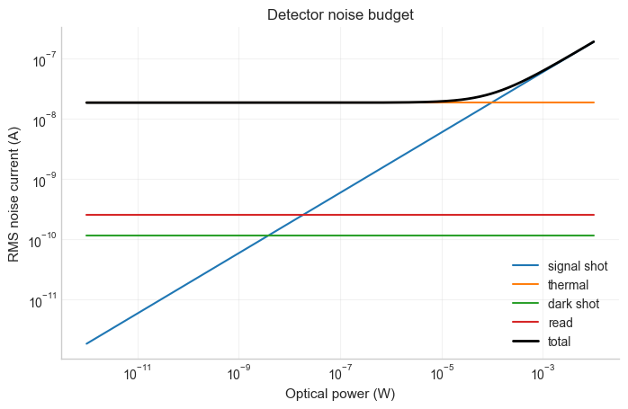
<br><strong>Detector noise budget.</strong> Separates signal shot noise,
thermal noise, dark-current noise, read noise, and total RMS current noise.
Useful for checking whether the limit is the diode physics, the load/TIA
front end, leakage current, or the electronics floor.
</td>
<td width="50%">
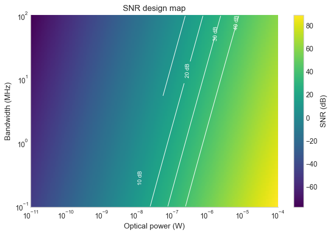
<br><strong>SNR design map.</strong> Shows SNR contours versus optical power and
bandwidth. This turns a target SNR and required bandwidth into a minimum optical
power or front-end requirement.
</td>
</tr>
</table>

### Laser Diode Thermal Control

<table>
<tr>
<td width="50%">
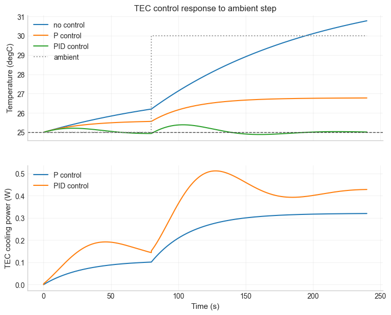
<br><strong>TEC control response.</strong> Compares no control, proportional
control, and full PID control after an ambient temperature step. The same plot
shows temperature error, settling behavior, control effort, and the wavelength
consequence of thermal drift.
</td>
<td width="50%">
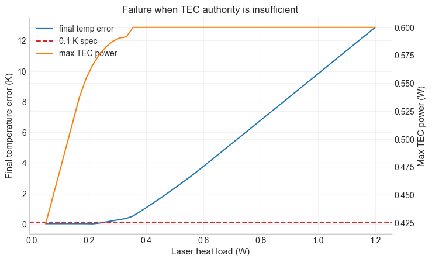
<br><strong>TEC authority failure.</strong> Shows the heat-load point where the
controller saturates and temperature error can no longer be regulated away.
No PID tuning fixes missing cooling authority; the actuator has to be sized for
the heat load.
</td>
</tr>
</table>

### ToF LiDAR Detection

<table>
<tr>
<td width="50%">
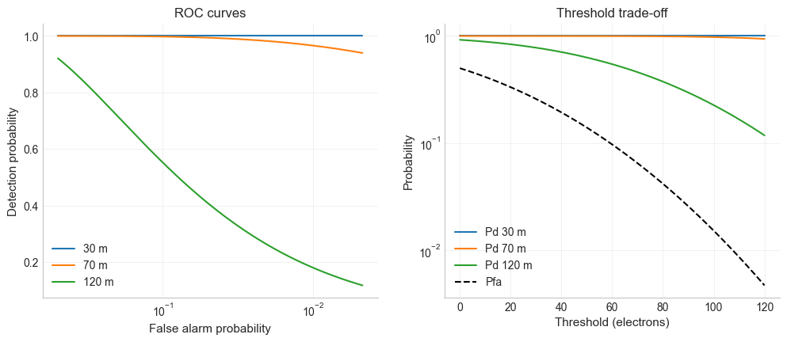
<br><strong>ROC and threshold trade-off.</strong> Connects detector electrons,
noise sigma, threshold choice, detection probability, and false alarm rate.
This is the step beyond "SNR looks OK": it supports threshold selection for a
specified false-positive budget.
</td>
<td width="50%">
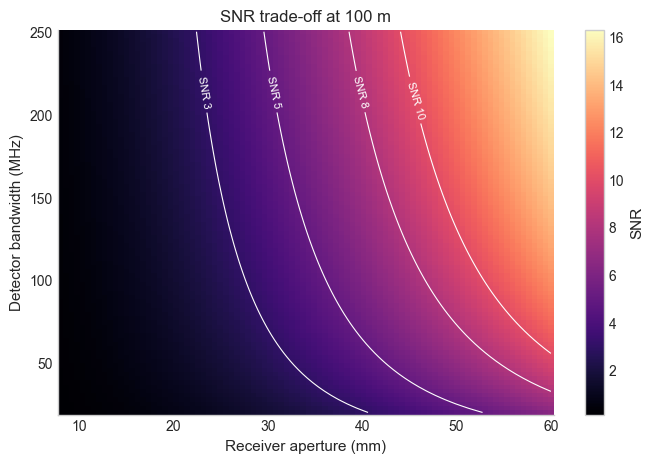
<br><strong>Aperture-bandwidth SNR map.</strong> Shows SNR at a fixed range as a
function of receiver aperture and detector bandwidth. It puts photon collection,
timing bandwidth, package size, cost, and receiver-noise pressure on the same
map.
</td>
</tr>
</table>

### CMOS / CCD Camera Sensor

<table>
<tr>
<td width="50%">
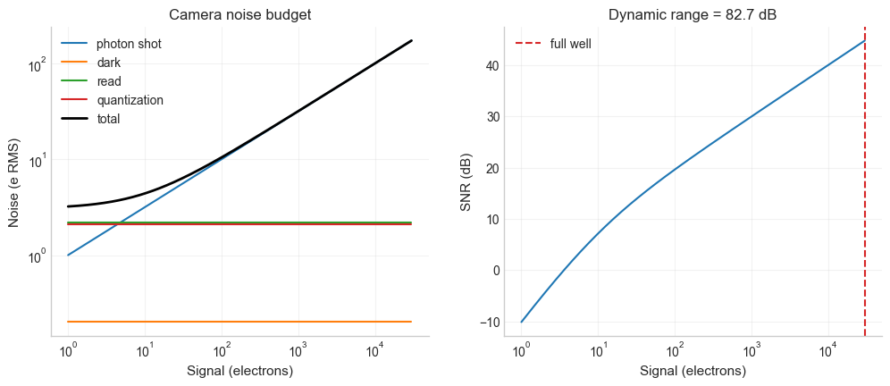
<br><strong>Camera noise and dynamic range.</strong> Breaks the electron-domain
noise budget into photon shot noise, dark noise, read noise, and quantization
noise. This is the view I want before changing exposure time, sensor gain, ADC
depth, or illumination.
</td>
<td width="50%">
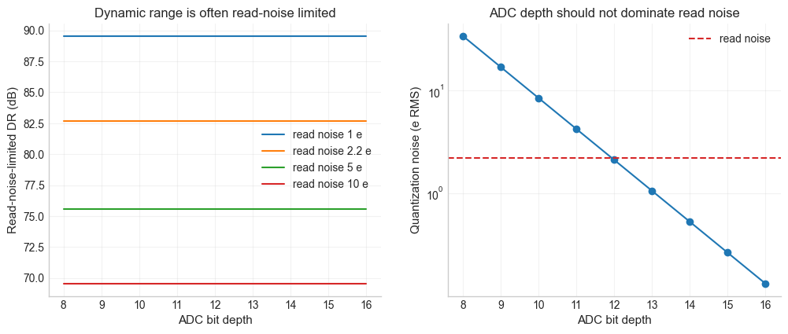
<br><strong>ADC bit-depth trade-off.</strong> Compares quantization noise with
read noise and full-well capacity. Extra ADC bits help only until quantization
drops below the analog noise floor.
</td>
</tr>
</table>

### Spectrometer Calibration and Peak Fitting

<table>
<tr>
<td width="50%">
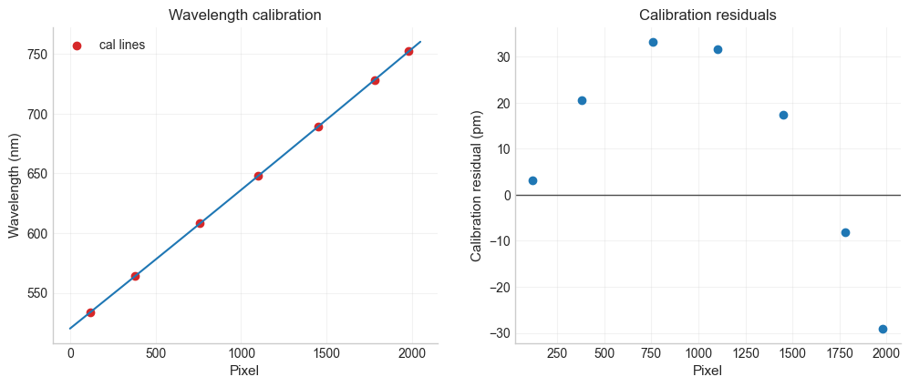
<br><strong>Wavelength calibration residuals.</strong> Shows the fitted
pixel-to-wavelength calibration and residual error in picometers. A metrology
workflow needs this residual plot, not just a calibrated-looking spectrum.
</td>
<td width="50%">
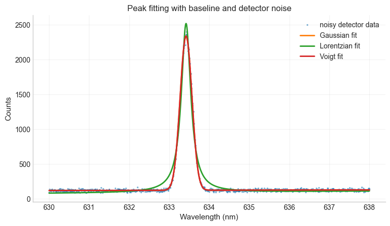
<br><strong>Peak fitting with uncertainty.</strong> Compares Gaussian,
Lorentzian, and Voigt fits under baseline and detector noise. The fitted center
depends on the assumed line-spread function, so the model choice has to be part
of the measurement.
</td>
</tr>
<tr>
<td width="50%">
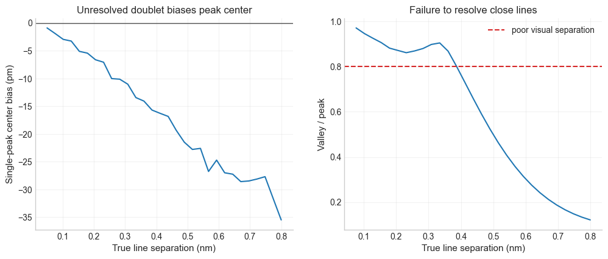
<br><strong>Unresolved doublet failure.</strong> Quantifies how two close lines
can bias a single-peak fit before the spectrum obviously looks split.
</td>
<td width="50%">
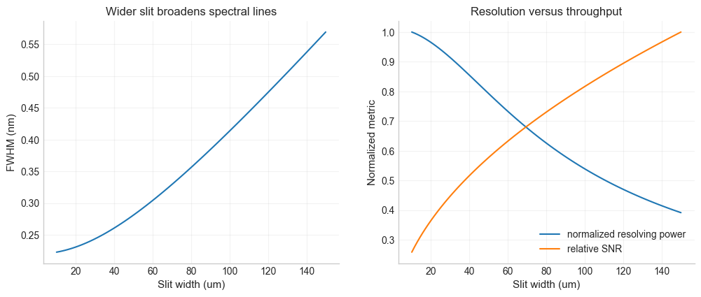
<br><strong>Resolution-throughput trade-off.</strong> Shows how slit width
changes line width, resolving power, and relative SNR. It is a compact way to
talk about slit choice as a hardware-performance trade-off.
</td>
</tr>
</table>

## Project Layout

```text
.
├── .github/
│   └── workflows/
│       └── ci.yml
├── README.md
├── pyproject.toml
├── requirements.txt
├── src/
│   ├── __init__.py
│   ├── detector.py
│   ├── laser.py
│   ├── noise.py
│   ├── control.py
│   └── plotting.py
├── notebooks/
│   ├── 01_photodetector_noise_snr_bandwidth.ipynb
│   ├── 02_laser_diode_thermal_pid_control.ipynb
│   ├── 03_tof_lidar_link_budget_detection.ipynb
│   ├── 04_cmos_camera_noise_dynamic_range_mtf.ipynb
│   └── 05_spectrometer_resolution_calibration_peak_fitting.ipynb
├── examples/
│   ├── run_detector_sweep.py
│   ├── run_laser_pid_demo.py
│   └── generate_featured_figures.py
├── scripts/
│   ├── generate_notebooks.py
│   └── extract_featured_figures.py
├── tests/
└── figures/
```

## Setup

```bash
python -m venv .venv
source .venv/bin/activate
pip install -r requirements.txt
python -m pytest
jupyter lab
```

## Reproducibility

The notebooks are for explanation. The reusable model code lives in `src/`, the
command-line demos are in `examples/`, artifact helpers are in `scripts/`, and
the sanity checks are in `tests/`.

```bash
python examples/run_detector_sweep.py        # writes PNG/CSV outputs
python examples/run_laser_pid_demo.py        # writes PNG/CSV outputs
python examples/generate_featured_figures.py # extracts README figures
```

The first two commands are normal headless simulations and are smoke-tested in
GitHub Actions. `generate_featured_figures.py` assumes the notebooks already
contain rendered PNG outputs; it extracts those images, it does not rerun the
notebooks from scratch.

## Engineering Themes

- Photodetector/APD SNR, bandwidth, and saturation limits
- Laser diode temperature drift and TEC PID control
- ToF LiDAR link budget, threshold detection, and ROC curves
- CMOS/CCD sensor noise, dynamic range, flat-field effects, and MTF
- Spectrometer calibration, resolution, peak fitting, and uncertainty

The models are intentionally compact rather than vendor-specific. They are meant
to keep the signal-chain reasoning easy to inspect: units, assumptions, scaling
laws, failure regimes, and design trade-offs.

## Validation and Limitations

These are engineering learning models, not product design tools. I would use
them to reason about scaling and failure modes, then replace parts of the model
with vendor data, measured transfer functions, or a more detailed optical,
electrical, or thermal model for real hardware work.

Main limitations:

- Detector models use simplified RMS noise budgets and do not include a full
  transimpedance-amplifier frequency response or layout/parasitic model.
- Laser thermal simulations use a lumped first-order thermal model rather than a
  spatial package, mount, and TEC finite-element model.
- LiDAR return models use simplified geometric spreading, diffuse-target
  assumptions, and Gaussian threshold detection.
- Camera simulations use simplified PRNU, hot-pixel, read-noise, dark-current,
  and quantization models.
- Spectrometer models are intended for calibration and fitting intuition, not
  full optical design, stray-light analysis, or vendor-grade instrument
  qualification.

## License

MIT License. See [LICENSE](LICENSE).
